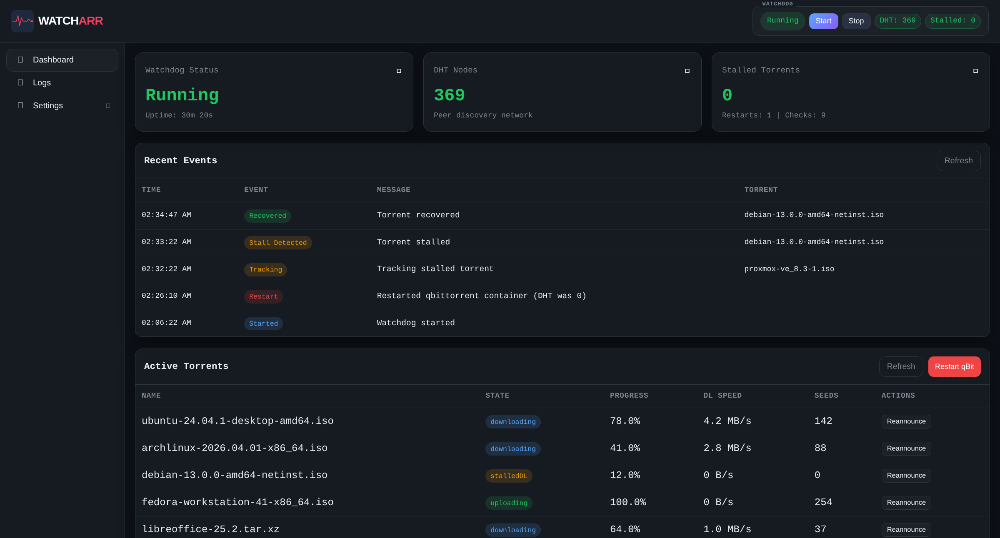
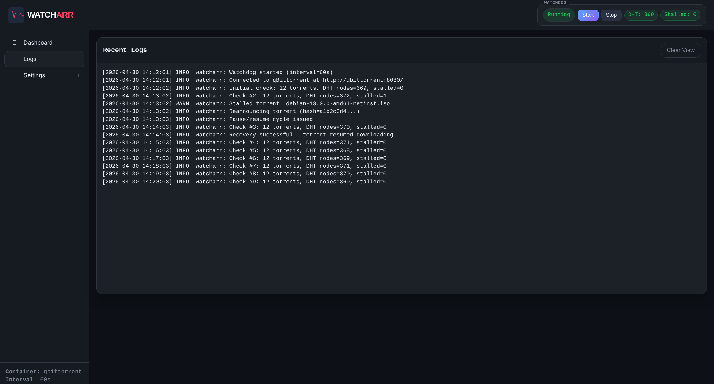
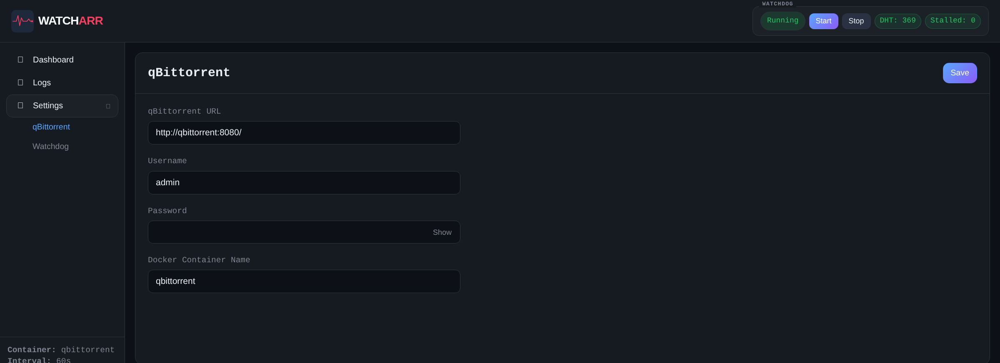

# Watcharr

[](LICENSE)
[](https://www.python.org/)
[](https://fastapi.tiangolo.com/)
[](https://www.docker.com/)

> A self-hosted watchdog for **qBittorrent** that detects stalled torrents, monitors DHT health, and recovers your client automatically — with a clean dark-themed dashboard for real-time monitoring and zero-restart configuration.



---

## Why Watcharr?

qBittorrent occasionally gets itself wedged: torrents stall in `stalledDL`/`stalledUP`, DHT drops to zero, and downloads quietly grind to a halt. Watcharr watches for those exact conditions and **takes graduated recovery action automatically** — reannounce → pause/resume → container restart — so you stop noticing days later that nothing has been moving.

It's a single container, talks to qBittorrent over its Web API, and ships with an embedded dashboard so you don't need a separate Grafana panel just to know it's working.

---

## Features

- **Stall Detection** — Continuously monitors qBittorrent for torrents stuck in `stalledDL`, `stalledUP`, or `metaDL` states
- **Automatic Recovery** — Attempts reannounce + pause/resume cycles on stalled torrents before escalating
- **DHT Health Monitoring** — Tracks DHT node count to detect network connectivity issues; zero DHT nodes + stalled torrents triggers a container restart
- **Container Restart** — Automatically restarts your qBittorrent Docker container via the Docker socket when recovery is needed
- **Stall Timeout & Removal** — Optionally removes torrents that remain stalled beyond a configurable timeout (disabled by default)
- **Web Dashboard** — Real-time dark-themed UI with status cards, event timeline, torrent table, live log viewer, and settings editor
- **Live Log Tailing** — Byte-offset log streaming in the browser with automatic scroll-pinning
- **Hot-Reloadable Settings** — Change any setting from the web UI without restarting the container; the watchdog picks up changes on the next check cycle
- **Layered Configuration** — Settings priority: Web UI (JSON file) > environment variables > built-in defaults
- **Optional Basic Auth** — Protect the dashboard with username/password when exposed beyond your local network
- **Health Check** — Built-in `/api/health` endpoint with Docker HEALTHCHECK for monitoring
- **Responsive Design** — Dashboard works on desktop and mobile

---

## Screenshots

### Dashboard

Live status, recent watchdog events, and the active torrent list — all in one view. The header pills surface DHT count and stalled count at a glance.


### Logs

Byte-offset log tailing with rotation detection. New lines stream in as the watchdog runs; the view auto-pins to the bottom unless you scroll up.



### Settings

Hot-reloadable configuration. Change qBittorrent credentials, check intervals, or stall handling — saves to a JSON file, picked up on the next watchdog cycle, no restart needed.



---

## Quick Start

### Prerequisites

- **Docker** and **Docker Compose**
- A running **qBittorrent** instance with the Web UI enabled

### 1. Clone the repository

```bash
git clone https://github.com/reedylab/watcharr.git
cd watcharr
```

### 2. Create your config files

Both `.env` and `docker-compose.yml` ship as `.example` files so you can keep your local edits without committing them. Copy them:

```bash
cp .env.example .env
cp docker-compose.yml.example docker-compose.yml
```

Edit `.env` with your actual values:

```env
# qBittorrent connection
QB_URL=http://your-qbittorrent-ip:8080/
QB_USERNAME=admin
QB_PASSWORD=your-password
QB_CONTAINER=qbittorrent

# Watchdog settings
CHECK_INTERVAL=60

# Optional: protect the dashboard with basic auth
# AUTH_USERNAME=admin
# AUTH_PASSWORD=changeme
```

> **Finding your qBittorrent details:** `QB_URL` is the same address you use to open the qBittorrent Web UI in your browser (the one with the login screen). `QB_USERNAME` / `QB_PASSWORD` are those Web UI credentials — not your system login. `QB_CONTAINER` must match the container name shown by `docker ps` exactly, otherwise restarts won't work.

### 3. Start the container

```bash
docker compose up -d
```

> ⚠️ **Heads up — Docker socket access:** Watcharr mounts `/var/run/docker.sock` so it can restart your qBittorrent container when recovery is needed. **This is root-equivalent on the host** — anything that can talk to the socket can run privileged containers. Only run images you trust, keep Watcharr on your trusted LAN, and consider [tecnativa/docker-socket-proxy](https://github.com/Tecnativa/docker-socket-proxy) if you want to restrict it to just `containers/restart`.

### 4. Open the dashboard

Navigate to **http://your-server-ip:5035** and click **Start** to begin monitoring.

---

## Compatibility

Tested and confirmed working with:

- **qBittorrent images:** `linuxserver/qbittorrent`, `binhex/qbittorrentvpn`, `binhex/arch-qbittorrentvpn`, `lscr.io/linuxserver/qbittorrent`, official `qbittorrentofficial/qbittorrent-nox`
- **VPN routing:** `qmcgaw/gluetun`-routed qBittorrent containers (use Watcharr to restart the qBit container, not gluetun itself)
- **qBittorrent version:** 4.5+ (anything with the v2 Web API)
- **Hosts:** Any Linux host with Docker + Compose; works fine on Synology/UnRAID/TrueNAS Scale where Docker is available

It will work with **any** qBittorrent setup whose Web API is reachable from the Watcharr container — the restart feature specifically requires qBit to be running as a Docker container on the same host, but stall detection / reannounce / pause-resume work over the network too.

---

## What This *Doesn't* Fix

Watcharr is a recovery layer, not a magic bullet. It will not fix:

- **Slow downloads caused by VPN port-forwarding issues.** If your VPN doesn't give you a forwarded port (notably **Mullvad — they removed port forwarding in 2023**), you're a passive peer and your usable peer pool shrinks dramatically. Watcharr can unstick wedged metadata, but it can't conjure peers that aren't connectable. Switch to ProtonVPN, AirVPN, or PIA if download speed and metadata reliability matter.
- **Dead torrents.** Reannounce + pause/resume can't recover a swarm that genuinely has zero working peers.
- **qBittorrent on a different host.** Restart needs Docker socket access on the same machine. Reannounce, pause/resume, and stall detection still work over the network — just not the container restart escalation step.
- **VPN-level UDP throttling or DNS issues.** If your VPN is dropping/blocking the UDP traffic DHT depends on, Watcharr will see DHT nodes drop and keep restarting qBit. Fix the VPN config, or raise `CHECK_INTERVAL` so you don't get into a restart loop.
- **Underlying qBittorrent bugs.** If a specific qBit version corrupts state on every restart, Watcharr will faithfully reproduce the corruption. Pin to a known-good qBit image.

---

## Configuration

Watcharr uses a three-layer configuration system. Each layer overrides the one below it:

```
1. Web UI settings (saved to /app/data/settings.json)   ← highest priority
2. Environment variables (.env file)
3. Built-in defaults                                     ← lowest priority
```

This means you can set initial values via environment variables, then fine-tune from the web UI without restarting the container.

### Environment Variables

| Variable | Default | Description |
|---|---|---|
| `QB_URL` | `http://localhost:8080/` | qBittorrent Web UI URL |
| `QB_USERNAME` | `admin` | qBittorrent username |
| `QB_PASSWORD` | *(empty)* | qBittorrent password |
| `QB_CONTAINER` | `qbittorrent` | Docker container name to restart |
| `CHECK_INTERVAL` | `60` | Seconds between watchdog checks |
| `STALL_TIMEOUT_MIN` | `5` | Minutes before a stalled torrent is removed (when auto-removal is enabled) |
| `STALL_REMOVAL_ENABLED` | `false` | Enable automatic removal of stalled torrents after timeout |
| `AUTH_USERNAME` | *(empty)* | Dashboard username (basic auth disabled when empty) |
| `AUTH_PASSWORD` | *(empty)* | Dashboard password (basic auth disabled when empty) |
| `LOG_FILE` | `/app/logs/watcharr.log` | Path to the log file inside the container |
| `SETTINGS_FILE` | `/app/data/settings.json` | Path to the persisted settings file |

### Docker Compose

```yaml
services:
  watcharr:
    build:
      context: .
    container_name: watcharr
    restart: unless-stopped
    ports:
      - "5035:5035"
    volumes:
      - /var/run/docker.sock:/var/run/docker.sock
      - watcharr-data:/app/data
      - watcharr-logs:/app/logs
    env_file:
      - .env

volumes:
  watcharr-data:
  watcharr-logs:
```

#### Volumes

| Mount | Purpose |
|---|---|
| `/var/run/docker.sock` | Required for Watcharr to restart the qBittorrent container |
| `watcharr-data` | Persists settings across container restarts |
| `watcharr-logs` | Persists log files |

> **Security note:** Mounting the Docker socket grants root-equivalent access to the host. Watcharr only uses it to call `containers/<QB_CONTAINER>/restart`, but the *capability* it has is unrestricted. If that's a concern, put a [docker-socket-proxy](https://github.com/Tecnativa/docker-socket-proxy) in front and grant only `CONTAINERS=1 POST=1`.

---

## Security

Watcharr's dashboard has **no authentication by default**. If your instance is only accessible on a trusted local network, this is fine. If you're exposing it beyond your LAN:

1. **Set basic auth** via `AUTH_USERNAME` and `AUTH_PASSWORD` environment variables, or
2. **Use a reverse proxy** (Nginx, Caddy, Traefik) with its own authentication layer

The `/api/health` endpoint is always accessible (bypasses auth) so Docker health checks continue to work.

---

## How It Works

Every `CHECK_INTERVAL` seconds, the watchdog runs through this decision loop:

```
1. Fetch torrent list from qBittorrent API
2. Fetch transfer info (DHT node count)
3. Identify stalled torrents (stalledDL, stalledUP states)
4. Identify metadata-stuck torrents (metaDL state + 0 DHT nodes)
5. For each stalled/stuck torrent:
   a. Send reannounce request
   b. Pause then resume the torrent
6. If (stalled OR metadata-stuck) AND DHT nodes == 0:
   → Restart qBittorrent container
   → Wait 30 seconds before next check
7. If auto-removal is enabled:
   → Track how long each torrent has been stalled
   → Remove torrents exceeding the stall timeout
```

---

## API Reference

All endpoints are under `/api`. Responses are JSON.

### Health

| Method | Endpoint | Description |
|---|---|---|
| `GET` | `/api/health` | Returns `{"status": "ok"}` — always accessible, bypasses auth |

### Control

| Method | Endpoint | Description |
|---|---|---|
| `GET` | `/api/status` | Watchdog status: running state, DHT nodes, stalled count, uptime, restart count, check count |
| `POST` | `/api/start` | Start the watchdog |
| `POST` | `/api/stop` | Stop the watchdog |

### Data

| Method | Endpoint | Description |
|---|---|---|
| `GET` | `/api/torrents` | Current torrent list (proxied from qBittorrent) |
| `GET` | `/api/events` | Last 200 watchdog events (stalls, restarts, removals, recoveries) |
| `GET` | `/api/logs/tail?pos=0&inode=` | Incremental log tail using byte offsets; supports log rotation detection via inode tracking |

### Actions

| Method | Endpoint | Body | Description |
|---|---|---|---|
| `POST` | `/api/restart-qbit` | — | Manually restart the qBittorrent container |
| `POST` | `/api/reannounce` | `{"hash": "..."}` | Manually reannounce a specific torrent |

### Settings

| Method | Endpoint | Description |
|---|---|---|
| `GET` | `/api/settings` | Returns the settings schema (field types, labels, options) and current values |
| `POST` | `/api/settings` | Save settings. Body is a JSON object of key-value pairs. Only known keys are accepted. |

---

## FAQ

**Q: I'm using Mullvad + gluetun and metaDL still stalls even with Watcharr running. Why?**
**A:** Mullvad removed port forwarding from all servers in 2023, so your qBit is passive — it can only initiate outbound connections to peers who themselves have open ports. On lightly seeded torrents that pool can be effectively zero, and no amount of restarting will materialize peers. Watcharr fixes wedged DHT and stuck-after-reconnect states; it cannot fix "no connectable peers." Long-term answer: switch to a VPN that still does port forwarding (ProtonVPN, AirVPN, PIA), then point gluetun at it and forward the port to qBit's listen port.

**Q: Will it work with `linuxserver/qbittorrent` / `binhex/qbittorrentvpn` / a gluetun-routed qBit?**
**A:** Yes. Watcharr only needs the qBit Web API to be reachable from its container, plus the Docker socket on the host so it can issue a restart. Set `QB_CONTAINER` to whatever `docker ps` shows for your qBit container.

**Q: My qBit is on a different host. Can I still use Watcharr?**
**A:** Partially. Stall detection, reannounce, and pause/resume all work over the network — point `QB_URL` at the remote Web UI. The container *restart* step needs Docker socket access on the same machine as qBit, so that escalation won't fire. For most setups the network-only recovery is enough.

**Q: Watcharr keeps restarting my qBit container in a loop. Help.**
**A:** That means DHT is staying at zero between checks. Likely causes: (1) your VPN is dropping/blocking UDP, (2) the VPN tunnel is flapping, or (3) qBit isn't actually starting cleanly. Check the dashboard's log view and the events table. As a temporary mitigation, increase `CHECK_INTERVAL` so the restart cooldown gives DHT time to bootstrap, and verify qBit can hold DHT > 0 by itself with Watcharr stopped.

**Q: Does this work with Docker on UnRAID / Synology / TrueNAS Scale?**
**A:** Yes — anywhere `docker compose` works. The Docker socket lives at the same path on all of them.

**Q: Does it auto-pull a published image?**
**A:** Not yet — for now `docker compose up -d` builds locally from source. A pre-built image on GHCR is on the roadmap.

---

## Project Structure

```
watcharr/
├── .github/workflows/ci.yml   # GitHub Actions CI
├── docker-compose.yml          # Container orchestration
├── Dockerfile                  # Python 3.11-slim image
├── entrypoint.sh               # Creates data/log dirs, starts uvicorn
├── requirements.txt            # Python dependencies
├── .env.example                # Environment template (safe to commit)
├── VERSION                     # Semantic version
├── LICENSE                     # MIT
│
├── core/
│   ├── config.py               # Layered settings: JSON > env > defaults
│   ├── logging_setup.py        # Dual-output logging (file + console)
│   └── watchdog.py             # WatchdogThread: monitoring loop + recovery logic
│
├── web/
│   ├── __init__.py              # Package marker
│   ├── app.py                   # FastAPI app, lifespan, all routes
│   ├── auth.py                  # Basic Auth dependency (optional)
│   ├── shared_state.py          # Watchdog global + settings schema
│   ├── templates/
│   │   └── ui.html              # Dashboard HTML shell
│   └── static/
│       ├── ui.js                # Client-side logic: polling, events, settings editor
│       └── style.css            # Dark theme, responsive layout
│
└── tests/
    ├── test_watchdog.py         # Core watchdog logic tests
    └── test_api.py              # API + auth tests
```

---

## Development

### Running locally (without Docker)

```bash
# Create a virtual environment
python3 -m venv .venv
source .venv/bin/activate

# Install dependencies
pip install -r requirements.txt

# Set required environment variables
export QB_URL="http://your-qbittorrent-ip:8080/"
export QB_USERNAME="admin"
export QB_PASSWORD="your-password"
export QB_CONTAINER="qbittorrent"

# Start the development server
uvicorn web.app:app --host 0.0.0.0 --port 5035 --workers 1
```

The dashboard will be available at `http://localhost:5035`.

> **Note:** Container restart functionality requires access to the Docker socket. When running outside Docker, make sure the Docker socket is accessible or expect restart operations to fail gracefully.

### Running tests

```bash
pip install pytest
python -m pytest tests/ -v
```

### Rebuilding the Docker image

```bash
docker compose build --no-cache
docker compose up -d
```

---

## Contributing

Contributions are welcome. To get started:

1. Fork the repository
2. Create a feature branch: `git checkout -b my-feature`
3. Make your changes
4. Run tests: `python -m pytest tests/ -v`
5. Test locally with Docker: `docker compose up --build`
6. Open a pull request

Please keep changes focused and include a clear description of what changed and why.

---

## License

[MIT](LICENSE)
